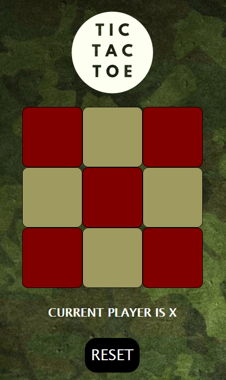

# **TIC TAC TOE**

Enjoy a classic game of Tic Tac Toe, constructed using HTML, CSS and Vanilla JavaScript. The game requires two-players on a single device and follows the traditional rules of player X goes first. The game can be reset with the use of the reset button. 

## Screenshots

## Play the game

[Link](https://www.martinnicola.com/tic_tac_toe){target="_blank"}

## Technologies Used

- HTML
- CSS
- JavaScript

## Future Work

- **Working CPU**
  - For now, the game is two player. However, I would like to add single player functionality by including a CPU.
  
- **Remote Two-Player Game**
  - I would like to add socket IO functionality in order to allow remote play between two players.

